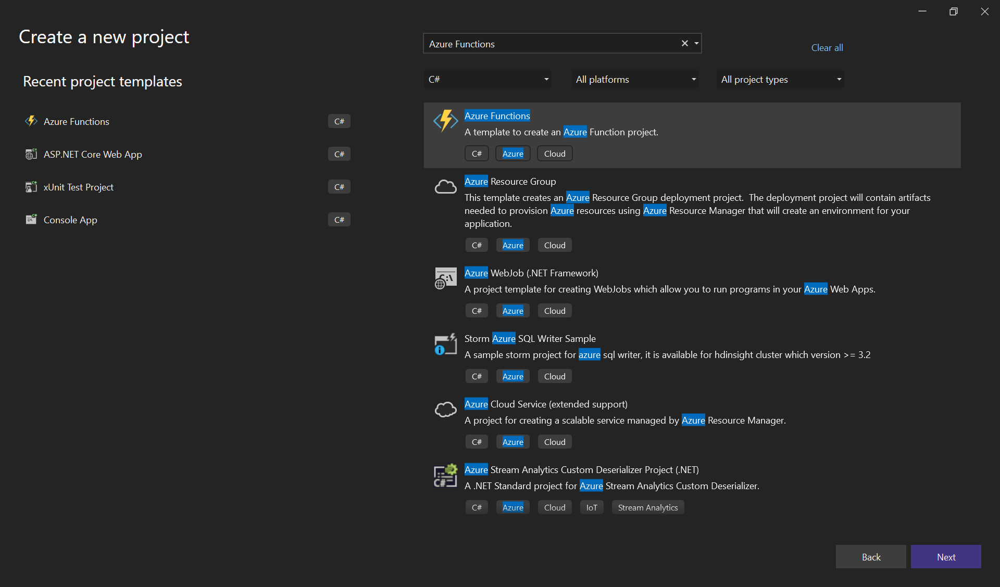
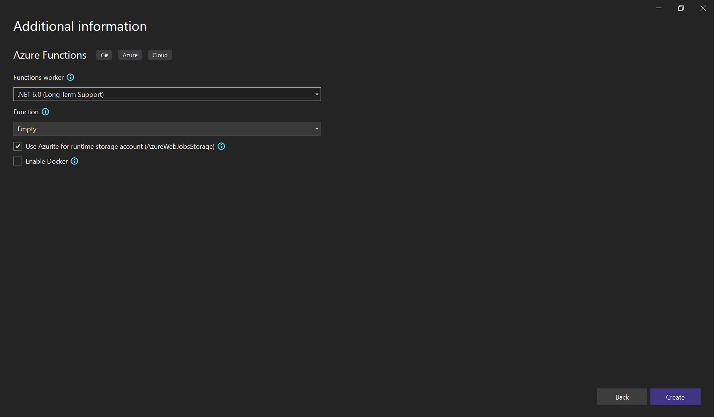
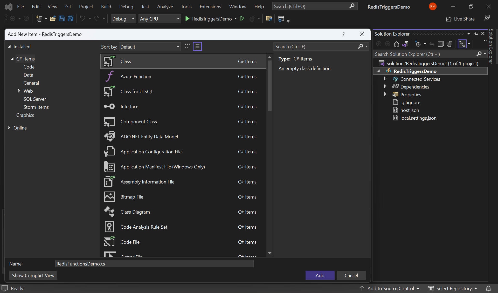
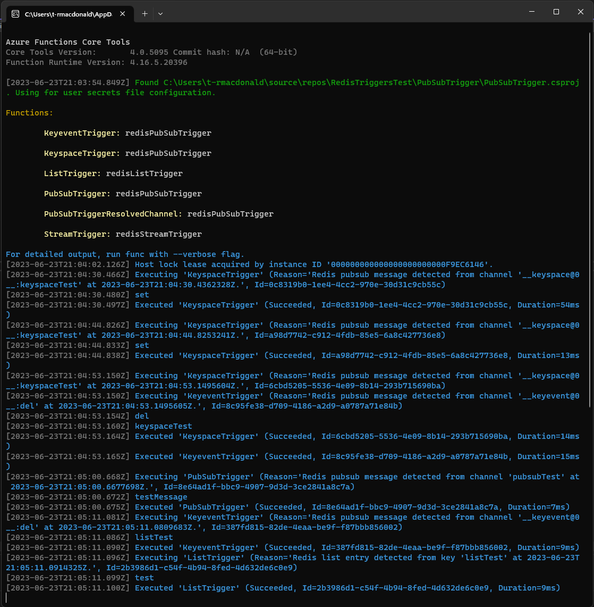
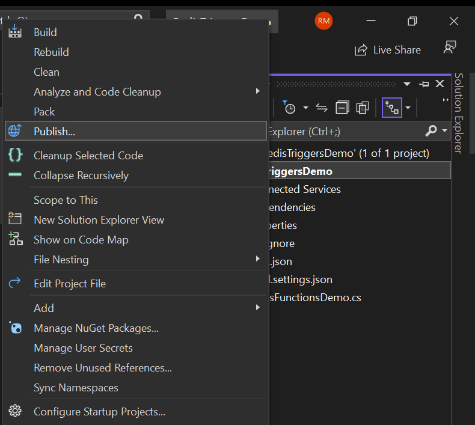
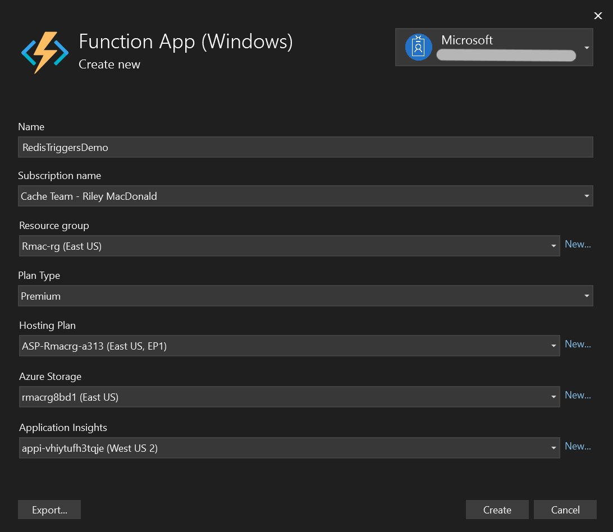

# Get Started with the Azure Functions Trigger for Azure Cache for Redis Using VS Code

## Summary
Azure Cache for Redis can now be used as a trigger to execute Azure Functions. Three Redis data types can be used to trigger Azure Function execution:

- [Redis Pub/Sub messages](https://redis.io/docs/manual/pubsub/)
- [Redis lists](https://redis.io/docs/data-types/lists/)
- [Redis streams](https://redis.io/docs/data-types/streams/)

The Pub/Sub trigger also enables Redis [keyspace notifications](https://redis.io/docs/manual/keyspace-notifications/) to be used as triggers. Keyspace notifications enable Redis to fire events to a pub/sub channel when keys are modified, or operations are performed. These events can then be used as triggers for Azure Functions, executing code once the event has occurred. This enables a variety of powerful use-cases, such as utilizing Azure Cache for Redis in a write-behind configuration or as a part of an event-driven architecture. The following actions are supported through keyspace notification as triggers:

- All supported commands that affect a given key (e.g. the key is updated, or set to expire)
- All uses of a specific supported command. (e.g. DEL, SET, or RENAME)

The list of [commands supported by keyspace notifications is listed here](https://redis.io/docs/manual/keyspace-notifications/). 

All tiers of Azure Cache for Redis are supported with the Redis trigger. 

## Unsupported Functionality
This feature is still in private preview, so there are a few limitations that will be removed in the future:
- Only .NET functions are supported. Java, Node, and Python functions will also be supported after the feature enters public preview.
- Only durable functions (i.e. Premium functions) are supported. We’ll support non-durable (i.e. Consumption functions) for public preview in the Basic, Standard, and Premium tiers.
- Azure Cache for Redis functions bindings are not yet supported.
- The Pub/Sub trigger is not capable of listening to keyspace notifications on clustered caches.

## Other Important Information
More information on the Redis Extension can be found [here](https://github.com/Azure/azure-functions-redis-extension. Documentation and source code are available. 
This feature is still in a private preview state. The product team is eager to get your feedback! Please email redisfunctionpreview@microsoft.com with any questions, suggestions, bugs, or feedback. 

## Getting Started Tutorial

The following tutorial shows how to implement basic triggers with Azure Cache for Redis and Azure Functions. Note that some of the steps will change as the product develops. This tutorial uses VS Code to write and deploy the Azure Function. It’s also possible to do the same thing using Visual Studio. In the future, you will be able to do this in the Azure portal as well.

### Requirements

- Azure subscription
- Visual Studio 
- Custom NuGet package (available in this repo)

### 1. Set up an Azure Cache for Redis Instance

Create a new **Azure Cache for Redis** instance using the Azure portal or your preferred CLI tool. Any tier and SKU should work. We’ll use a _Standard C1_ instance, which is a good starting tier and SKU. 


The default settings should suffice. We’ll use a public endpoint for this demo, but you’ll likely want to use a private endpoint for anything in production. 
The cache can take a bit to create, so feel free to move to the next section while this completes. 

### 2. Set up Visual Studio

Launch Visual Studio and select **New** > **Project** from the **File** menu. In the **Create a new project** dialogue, search for "Azure Functions" and then select **Next**.
Make sure you are signed in to the account associated with your Azure subscription


 
Next, enter a **Project name** for your project, and select **Next**. The Project name must be valid as a C# namespace, so dont use underscores, hyphens, or nonalphanumeric characters.
 
Under **Additional information**, use the settings specified below the following image.



- **.NET 6.0 (Long Term Support)** as the Functions worker
- **Empty** as the Function
- Select **Use Azurite for runtime storage account** as a storage account is required for function state management

Now select **Create** to create an empty function project. This project has the basic configuration files needed to run your functions.
Finally, we will add a new class by right clicking in the solution explorer and navigating to **Add** > **New item** and creating a C# class. I've named mine "RedisFunctionsDemo"



### 3. Install Necessary NuGet packages

You’ll need to install two NuGet packages:
1. [StackExchange.Redis](https://www.nuget.org/packages/StackExchange.Redis/), which is the primary .NET client for Redis. 
1. Microsoft.Azure.WebJobs.Extensions.Redis, which is the extension that allows Redis keyspace notifications to be used as triggers in Azure Functions. 

Install StackExchange.Redis by going to the **Package Manager Console** tab in Visual Studio and entering the following command:

```
dotnet add package StackExchange.Redis
```

Next, we need to install the Microsoft.Azure.WebJobs.Extensions.Redis package. When this feature is released publically, this will be very simple. But we have to jump through some additional hoops right now. 

   1. Create a `NuGet.Config` file in the project folder (`RedisTriggersDemo` in step 2 above):
      ```
      <?xml version="1.0" encoding="utf-8"?>
      <configuration>
        <packageSources>
          <add key="local-packages" value="./local-packages" />
        </packageSources>
      </configuration>
      ```
   1. Add the following line to the `<PropertyGroup>` section of the csproj.
      ```
      <RestoreSources>$(RestoreSources);./local-packages;https://api.nuget.org/v3/index.json</RestoreSources>
      ```
   1. Create a folder `local-packages` within the project folder, and download the latest NuGet package from [GitHub Releases](https://github.com/Azure/azure-functions-redis-extension/releases) to this `local-packages` folder.
   1. Install the package by running the following commands in the **Package Manager Console**:
      ```
      dotnet add package Microsoft.Azure.WebJobs.Extensions.Redis --prerelease
      dotnet restore
      ``` 

### 4. Configure Cache

Go to your newly created Azure Cache for Redis instance. Two steps need to be taken here. 
First, we need to enable **keyspace notifications** on the cache to trigger on keys and commands. Go to your cache in the Azure portal and select the **Advanced settings** blade. Scroll down to the field labled _notify-keyspace-events_ and enter “KEA”. Then select Save at the top of the window. “KEA” is a configuration string that enables keyspace notifications for all keys and events. More information on keyspace configuration strings can be found [here](https://redis.io/docs/manual/keyspace-notifications/). 


Second, go to the **Access keys** blade and write down/copy the Primary connection string field. We’ll use this to connect to the cache.  


### 5. Set up the example code

Go back to VS Code, add a file to the project called “RedisFunctions.cs” Copy and paste the [RedisSamples.cs](https://github.com/Azure/azure-functions-redis-extension/blob/main/samples/RedisSamples.cs) code found in the _Samples_ folder of this repo.

This example shows multiple different triggers:
1.	_PubSubTrigger_, which is triggered when activity is published to the a pub/sub channel named “pubsubTest”
1.	_KeyspaceTrigger_, which is built on the Pub/Sub trigger. This looks for changes to the key “keyspaceTest”
1.	_KeyeventTrigger_, which is also built on the Pub/Sub trigger. This looks for any use of the “DEL” command. 
1.	_ListsTrigger_, which looks for changes to the list “listTest”
1.	_ListsMultipleTrigger_, which looks for changes to list “listTest1 and listTest2”
1.	_StreamsTrigger_, which looks for changes to the stream “streamTest”
1.	_StreamsMultipleTrigger_, which looks for changes to streams “streamTest1 and streamTest2”

To connect to your cache, take the connection string you copied from earlier and paste to replace the value of `localhost` at the top of the file. (This is “127.0.0.1:6379” by default).


 
### 6. Build and run the code locally
Switch to the **Run and debug** tab in VS code and click on the green arrow to debug the code locally. If you don’t have Azure Functions core tools installed, you will be prompted to do so. In that case, you’ll need to restart VS Code after installing.
 
The code should build successfully, which you can track in the Terminal output. 
To test the trigger functionality out, try creating and deleting the _keyspaceTest_ key. You can use any way you prefer to connect to the cache, but the easiest way will likely be to use the built-in Console tool in the Azure Cache for Redis portal. Bring up the cache instance in the Azure portal, and click the Console button to open it up.
 


Once it is open, try the following commands:
- SET keyspaceTest 1
- SET keyspaceTest 2
- DEL keyspaceTest
- PUBLISH pubsubTest testMessage
- LPUSH listTest test
- XADD streamTest * name Clippy


You should see the triggers activating in the terminal:


 
### 6. Deploy Code to an Azure Function
Deploy your Azure function by going to the **Solution Explorer**, right click on your **Function App**, and select **Publish**. 
We will be publishing to Azure as an "Azure Function App (Windows)" but there are other options as well.


 
You will see several prompts on information to configure the new functions app:
- Enter a unique name
- Select your cache Subscription
- Select an existing or new resource group to hold the Function App
- Choose the same region as your cache instance
- Select **Premium** as the hosting plan
- Create a new App Service plan
- Choose the **EP1** pricing tier.
- Choose an existing storage account or create a new one
- Create a new Application Insights resource (we’ll use this to confirm the trigger is working)



Wait a few minutes for the new Function App to be published.
Once deployment is complete, open your Function App in the Azure Portal and select the **Log Stream** blade. Wait for log analytics to connect, and then use the Redis console to activate any of the triggers. You should see the triggers being logged here. 


## Conclusion
We hope the above tutorial helps you get started using the Redis trigger functionality! Please email redisfunctionpreview@microsoft.com with any questions, suggestions, bugs, or feedback. We’re eager to hear what you think. 

